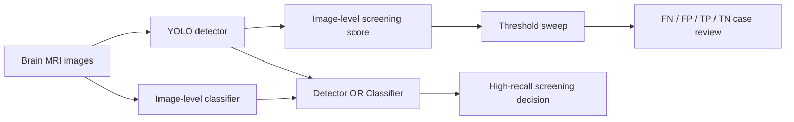

# 脑肿瘤 YOLO 筛查方法讲解报告

> 报告形式：Markdown 版 PPT 讲解稿。每一节可以当作一页幻灯片使用，包含页面标题、核心信息、配图和讲解备注。
>
> 项目定位：本项目用于模型开发、实验汇总和研究展示，不是临床诊断工具。

## 一页总览

本项目把 YOLO11 脑肿瘤检测模型扩展成一个筛查工作流。重点不是只画检测框，而是尽量减少真实阳性 MRI 图像被漏掉的情况。

最关键的实验结论如下：

| 对比项 | Baseline YOLO11n 320px | 最佳检测器 YOLO11n 640px | 分类器 OR 最佳检测器 |
| --- | ---: | ---: | ---: |
| 图像级 Recall | 0.407 | 0.765 | 0.975 |
| 图像级 Precision | 0.384 | 0.373 | 0.393 |
| 图像级 Specificity | 0.627 | 0.268 | 0.141 |
| False negatives | 48 | 19 | 2 |
| 适合用途 | 基线对照 | 更好的检测器 | 高召回筛查 |

核心解释：baseline 的主要问题是小肿瘤漏检。更高输入分辨率和轻量医学增强可以减少漏检；再加入图像级分类器做第二意见后，阳性召回率可以提高到 0.975，但代价是 false positives 增多、specificity 降低。

---

## Slide 01 | 封面：从检测到筛查

**这一页要讲什么**

- 题目：脑肿瘤 MRI 的 YOLO 检测与筛查工作流。
- 目标：把目标检测模型改造成更适合筛查场景的流程。
- 筛查任务的优先级：先减少漏检，再讨论误报和定位质量。

**讲解稿**

传统目标检测更关注框画得准不准，而医学筛查更关注“阳性病例有没有被漏掉”。这个项目保留 YOLO 的定位能力，同时增加 false negative 分析、阈值扫描和图像级分类辅助。最后形成一个可以解释、可以复现、可以比较不同策略的筛查报告。

**方法流程图**



**讲者提示**

这里要强调：这不是把 YOLO 换成分类器，而是让检测器和分类器分工。YOLO 负责定位，分类器负责在图像级别补充阳性证据。

---

## Slide 02 | 研究问题：为什么不能只看 mAP

**这一页要讲什么**

- YOLO 的 mAP、precision、recall 是检测框级评估。
- 医学筛查更关心图像级结果：这张图到底该不该被标为 positive。
- 同一个模型在检测指标和筛查指标上可能表现不同。

**配图：验证集标签与 baseline 预测**

| Ground truth labels | Baseline predictions |
| --- | --- |
|  |  |
|  |  |

**讲解稿**

检测指标回答的是“框和类别预测整体是否准确”；筛查指标回答的是“真实阳性图像有没有被模型标出来”。在本项目里，positive 是更重要的类别，所以筛查脚本只要看到 class 1 的 positive 检测框置信度超过阈值，就把整张图判为 positive。

**讲者提示**

后面所有筛查表格里的 TP、FP、TN、FN 都是图像级判断，不是检测框级判断。

---

## Slide 03 | 数据集结构与类别分布

**这一页要讲什么**

- 训练集 893 张图，验证集 223 张图。
- 训练集阳性和阴性数量接近；验证集阴性更多。
- 数据集中存在大量小框，这是后续漏检的直接背景。

**数据统计**

| 数据集 | 图片数 | Positive 图片 | Negative 图片 | 检测框数 | Positive 框 | 小框 <2% | 缺失标签 | 非法标签行 |
| --- | ---: | ---: | ---: | ---: | ---: | ---: | ---: | ---: |
| train | 893 | 459 | 434 | 925 | 488 | 612 | 15 | 0 |
| val | 223 | 81 | 142 | 241 | 87 | 179 | 0 | 0 |

**配图：数据审计输出**

| 图像级类别分布 | 检测框面积分布 |
| --- | --- |
|  |  |

**讲解稿**

这两张图说明了两个问题：第一，数据不是极端失衡，但验证集阴性更多，因此 specificity 不能忽略；第二，小框数量非常多，训练集有 612 个小框、验证集有 179 个小框。对于 YOLO 来说，小目标在下采样后更容易丢失细节，所以后面要尝试更高分辨率和更适合医学图像的增强策略。

---

## Slide 04 | 标注分布：小框和位置偏差

**这一页要讲什么**

- 标注图可以检查类别、框大小和框位置是否合理。
- correlogram 可以观察框的中心位置、宽高和类别之间的关系。
- 如果大量框集中在很小面积区间，模型很容易学成“保守检测器”。

**配图：baseline 标注分布**

| Labels overview | Labels correlogram |
| --- | --- |
|  |  |

**配图：640px 医学增强实验标注分布**

| Labels overview | Labels correlogram |
| --- | --- |
|  |  |

**讲解稿**

这些标注分布图不是最终性能图，但它们帮助解释模型为什么会漏检。小框越多，模型越依赖高分辨率输入；如果病灶区域对比度低、边界不清晰，强增强还可能破坏本来就弱的医学信号。

---

## Slide 05 | Baseline 模型设置

**这一页要讲什么**

- Baseline 使用 YOLO11n。
- 输入尺寸为 320px。
- 原始增强较强，适合作为起点，但不一定适合医学小目标。
- baseline 的作用是提供对照组。

**训练样例图**

| Train batch 0 | Train batch 1 | Train batch 2 |
| --- | --- | --- |
|  |  |  |

**讲解稿**

YOLO11n 是轻量模型，训练和推理都比较快。问题在于 320px 输入会压缩 MRI 图像细节，小病灶在特征图中可能只剩很少像素。因此 baseline 可以作为工程起点，但不一定能满足筛查对漏检率的要求。

---

## Slide 06 | Baseline 检测训练结果

**这一页要讲什么**

- Ultralytics 检测评估：best epoch = 9。
- 检测框级指标：precision 0.469，recall 0.810，mAP50 0.508，mAP50-95 0.284。
- 这些指标说明模型学到了定位能力，但还不能直接证明筛查足够可靠。

**配图：训练曲线和检测曲线**

| Results | PR curve |
| --- | --- |
|  |  |

| F1 curve | Confusion matrix |
| --- | --- |
|  |  |

**讲解稿**

从检测角度看，baseline 有一定能力；但筛查不是只看 mAP。筛查要把检测结果转成图像级 positive / negative 判断，并观察阈值变化时漏检数量如何变化。

---

## Slide 07 | Baseline 图像级筛查结果

**这一页要讲什么**

- 阈值 0.25 下，baseline 图像级 recall 只有 0.407。
- 真实阳性 81 张中只找回 33 张，漏掉 48 张。
- specificity 为 0.627，说明它相对保守，但这个保守性带来了严重漏检。

**筛查结果表**

| Threshold | TP | FP | TN | FN | Precision | Recall | Specificity | F1 |
| ---: | ---: | ---: | ---: | ---: | ---: | ---: | ---: | ---: |
| 0.25 | 33 | 53 | 89 | 48 | 0.384 | 0.407 | 0.627 | 0.395 |

**配图：baseline 筛查报告**

| Image-level confusion matrix | Threshold curves |
| --- | --- |
|  |  |

**讲解稿**

这页是 baseline 的关键问题。虽然模型不是完全无效，但如果筛查场景把漏检看得非常重，那么 48 个 false negatives 明显不可接受。后续改进的目标就是尽量把 FN 降下来。

---

## Slide 08 | Baseline 筛查案例：TP、FN、FP、TN

**这一页要讲什么**

- 只看总指标不够，还需要看实际图像。
- TP 说明模型能抓到一些阳性。
- FN 显示真实阳性被完全漏掉。
- FP 显示模型也会把阴性区域误认为阳性。
- TN 是模型正常排除阴性的例子。

**配图：baseline 典型案例**

| True positive | False negative | False positive | True negative |
| --- | --- | --- | --- |
| .jpg>) | .jpg>) | .jpg>) | .jpg>) |
| .jpg>) | .jpg>) | .jpg>) | .jpg>) |

**讲解稿**

这页要把数字和图像联系起来。FN 案例最值得关注，因为真实有病灶但模型没有给出足够高的 positive 置信度。FP 也重要，但在筛查里，FP 通常可以通过后续医生复查或更高精度模型进一步过滤。

---

## Slide 09 | False Negative 专项分析

**这一页要讲什么**

- Baseline 在阈值 0.25 下漏检 48 张阳性图像。
- 这些漏检对应 53 个 positive 框。
- 48 / 53 个漏检框面积小于图像面积的 2%。
- 漏检框面积中位数为 0.008，说明多数漏检都是小目标。

**配图：漏检框面积分布**


**讲解稿**

FN 分析脚本会把验证集中真实 positive、但模型没有给出足够 positive 置信度的图像筛出来。红框表示真实病灶位置，模型没有成功检测出来。这个分析把问题从“模型表现不好”变成了更具体的结论：模型主要漏小病灶。

---

## Slide 10 | Baseline 漏检图像画廊

**这一页要讲什么**

- 多数漏检样本的病灶区域小、边界弱、对比度不高。
- 这些图可以直接放进 PPT 作为失败案例。
- 讲解时要说明红框是 ground truth，代表模型本该发现的位置。

**配图：baseline false negative examples**

| FN 1 | FN 100 | FN 102 | FN 105 |
| --- | --- | --- | --- |
| .jpg>) | .jpg>) | .jpg>) | .jpg>) |

| FN 110 | FN 117 | FN 138 | FN 146 |
| --- | --- | --- | --- |
| .jpg>) | .jpg>) | .jpg>) | .jpg>) |

**讲解稿**

这些失败案例展示了 baseline 的共同弱点：病灶框经常很小，有些位于边缘区域或低对比度区域。对于筛查模型来说，这类漏检比普通定位误差更严重，因为它会把整张阳性图像判成阴性。

---

## Slide 11 | 改进思路：更高分辨率和医学增强

**这一页要讲什么**

- 把输入尺寸从 320px 提高到 640px。
- 使用更轻的医学图像增强，避免过强增强破坏 MRI 细节。
- 比较 nano、small、medium 三种模型规模。
- 目标是减少 false negatives，而不是单纯追求最高 precision。

**实验设计**

| 实验 | 模型 | 输入尺寸 | 主要目的 |
| --- | --- | ---: | --- |
| `runs/detect/train` | YOLO11n | 320 | baseline |
| `runs/detect/train2` | YOLO11n | 320 | baseline 重复 |
| `runs/experiments/medical_focus_small_640` | YOLO11s | 640 | 小目标 pilot |
| `runs/experiments/medical_nano_640` | YOLO11n | 640 | 轻医学增强，整体最佳 |
| `runs/experiments/medical_small_640` | YOLO11s | 640 | 召回导向 |
| `runs/experiments/medical_medium_640` | YOLO11m | 640 | 中等模型规模 |

**配图：640px 样例预测对比**

| Sample 1 | Sample 10 | Sample 100 |
| --- | --- | --- |
| _comparison.png>) | _comparison.png>) | _comparison.png>) |

**讲解稿**

提高分辨率的逻辑很直接：如果病灶在原图里本来就小，320px 下会更小；640px 能保留更多边缘和纹理信息。医学图像增强也要谨慎，过强的颜色或几何扰动可能让模型学到不稳定特征。

---

## Slide 12 | 最佳检测器：medical_nano_640

**这一页要讲什么**

- `medical_nano_640` 是本轮实验中综合表现最好的检测器。
- best epoch = 41。
- 检测框级 mAP50 从 0.508 提升到 0.540。
- mAP50-95 从 0.284 提升到 0.373。

**检测实验结果表**

| Experiment | Best epoch | Precision | Recall | mAP50 | mAP50-95 |
| --- | ---: | ---: | ---: | ---: | ---: |
| baseline 320px | 9 | 0.469 | 0.810 | 0.508 | 0.284 |
| medical_nano_640 | 41 | 0.492 | 0.740 | 0.540 | 0.373 |
| medical_small_640 | 24 | 0.468 | 0.826 | 0.526 | 0.363 |
| medical_medium_640 | 25 | 0.452 | 0.819 | 0.515 | 0.358 |

**配图：medical_nano_640 训练与验证**

| Results | PR curve |
| --- | --- |
|  |  |

| F1 curve | Confusion matrix |
| --- | --- |
|  |  |

**讲解稿**

这里要注意，检测框级 recall 并没有比 baseline 表格里的 YOLO recall 更高，但定位质量和 mAP50-95 明显提升。更重要的是，当它进入图像级筛查流程时，false negatives 从 48 降到 19，这才是筛查目标最关心的变化。

---

## Slide 13 | 其他 640px 检测器对比

**这一页要讲什么**

- small 和 medium 模型并没有简单地“越大越好”。
- `medical_small_640` 的 recall 较高，但整体平衡略低于 nano。
- `medical_medium_640` 参数更多，但本轮结果没有超过 nano。
- 当前推荐使用 `medical_nano_640` 作为最佳检测器。

**配图：small 与 medium 训练结果**

| Medical small results | Medical medium results |
| --- | --- |
|  |  |

| Medical small PR | Medical medium PR |
| --- | --- |
|  |  |

**讲解稿**

医学数据量不大时，大模型不一定稳定超过小模型。更大的模型可能需要更多 epoch、更多数据增强调参和更多随机种子验证。当前结果说明 `medical_nano_640` 在性能、稳定性和计算成本之间最合适。

---

## Slide 14 | 最佳检测器的图像级筛查表现

**这一页要讲什么**

- 在阈值 0.25 下，最佳检测器图像级 recall = 0.765。
- False negatives 从 baseline 的 48 降到 19。
- 但是 FP 增加到 104，specificity 降到 0.268。
- 这说明检测器更积极了，找回更多阳性，同时误报也更多。

**筛查结果表**

| Detector | Threshold | TP | FP | TN | FN | Precision | Recall | Specificity | F1 |
| --- | ---: | ---: | ---: | ---: | ---: | ---: | ---: | ---: | ---: |
| baseline 320px | 0.25 | 33 | 53 | 89 | 48 | 0.384 | 0.407 | 0.627 | 0.395 |
| medical_nano_640 | 0.25 | 62 | 104 | 38 | 19 | 0.373 | 0.765 | 0.268 | 0.502 |

**配图：最佳检测器筛查报告**

| Confusion matrix | Threshold curves |
| --- | --- |
|  |  |

**讲解稿**

这页体现了筛查中的典型 tradeoff。为了少漏诊，模型会把更多可疑图像标成 positive，因此 FP 增多。对于筛查系统，这通常是可以接受的第一阶段策略，因为后面还可以用医生复核或更高精度模型做二次过滤。

---

## Slide 15 | 最佳检测器案例：成功与失败都要展示

**这一页要讲什么**

- 最佳检测器能找回更多阳性样本。
- 仍然有 19 个 FN，需要继续分析。
- 误报集中在一些阴性但形态相似的区域。

**配图：medical_nano_640 筛查案例**

| True positive | False negative | False positive | True negative |
| --- | --- | --- | --- |
| .jpg>) | .jpg>) | .jpg>) | .jpg>) |
| .jpg>) | .jpg>) | .jpg>) | .jpg>) |

**讲解稿**

展示最佳模型时，不应该只展示成功案例。FN 和 FP 是后续研究最有价值的样本：FN 告诉我们哪里还会漏，FP 告诉我们什么样的阴性结构会被模型误认为病灶。

---

## Slide 16 | 剩余漏检：最佳检测器仍然困难的样本

**这一页要讲什么**

- `medical_nano_640` 的 FN 数量比 baseline 少，但没有完全消失。
- 剩余 FN 中 14 / 19 个框仍小于图像面积 2%。
- 中位框面积约 0.010。
- 小目标仍然是最顽固的问题。

**配图：最佳检测器 FN 分布与样例**

| FN area histogram | FN 100 | FN 138 |
| --- | --- | --- |
|  | .jpg>) | .jpg>) |

| FN 14 | FN 146 | FN 156 |
| --- | --- | --- |
| .jpg>) | .jpg>) | .jpg>) |

**讲解稿**

这页的重点是承认模型仍有边界。最佳检测器已经显著减少漏检，但剩余漏检仍然集中在小病灶和低信号区域。下一阶段如果继续优化检测器，可以考虑 crop-based training、切片级上下文增强和更长训练。

---

## Slide 17 | 为什么加入图像级分类器

**这一页要讲什么**

- 检测器擅长定位，但可能因为框置信度不够而漏掉图像。
- 分类器不输出框，只判断整张图是否 positive。
- 分类器可以作为第二意见，弥补检测器的漏检。
- 组合规则使用 OR：任一模型认为 positive，就进入 positive 筛查结果。

**组合规则**

```text
predict positive if:
  detector positive confidence >= detector threshold
  OR classifier positive probability >= classifier threshold
```

**配图：分类器训练和验证输出**

| Classifier results | Classifier confusion matrix |
| --- | --- |
|  |  |

| Validation labels | Validation predictions |
| --- | --- |
|  |  |

**讲解稿**

分类器不替代 YOLO，因为它不能告诉我们病灶在哪里。但在筛查环节，它可以帮助回答“这张图是否可疑”。如果检测器漏了一个小病灶，分类器仍可能从全局纹理或局部异常中捕捉到 positive 信号。

---

## Slide 18 | 三种筛查策略对比

**这一页要讲什么**

- detector only：只用检测器。
- classifier only：只用图像级分类器。
- classifier OR detector：任何一个模型提示 positive 就判为 positive。
- OR 策略显著降低 FN，但 specificity 会下降。

**策略结果：baseline 检测器 + 分类器**

| Strategy | Classifier threshold | Detector threshold | Precision | Recall | Specificity | F1 | FN | FP |
| --- | ---: | ---: | ---: | ---: | ---: | ---: | ---: | ---: |
| detector only |  | 0.25 | 0.384 | 0.407 | 0.627 | 0.395 | 48 | 53 |
| classifier only | 0.30 |  | 0.528 | 0.704 | 0.641 | 0.603 | 24 | 51 |
| classifier OR detector | 0.30 | 0.25 | 0.443 | 0.864 | 0.380 | 0.586 | 11 | 88 |

**策略结果：最佳检测器 + 分类器**

| Strategy | Classifier threshold | Detector threshold | Precision | Recall | Specificity | F1 | FN | FP |
| --- | ---: | ---: | ---: | ---: | ---: | ---: | ---: | ---: |
| detector only |  | 0.25 | 0.373 | 0.765 | 0.268 | 0.502 | 19 | 104 |
| classifier only | 0.30 |  | 0.528 | 0.704 | 0.641 | 0.603 | 24 | 51 |
| classifier OR detector | 0.30 | 0.25 | 0.393 | 0.975 | 0.141 | 0.560 | 2 | 122 |

**配图：策略对比图**

| Baseline detector strategies | Best detector strategies |
| --- | --- |
|  |  |

**讲解稿**

如果目标是常规分类性能，classifier only 的 F1 最好；如果目标是筛查召回，classifier OR detector 最好。最佳检测器和分类器组合后，FN 从 19 降到 2，说明分类器确实补回了大部分检测器漏掉的阳性图像。

---

## Slide 19 | 阈值选择：召回和特异性的取舍

**这一页要讲什么**

- 阈值越低，recall 越高，false positives 通常越多。
- 阈值越高，specificity 越高，但漏检会增加。
- 筛查场景通常选择较高 recall 的操作点。

**baseline 检测器阈值扫描**

| Threshold | TP | FP | TN | FN | Precision | Recall | Specificity | F1 |
| ---: | ---: | ---: | ---: | ---: | ---: | ---: | ---: | ---: |
| 0.01 | 80 | 140 | 2 | 1 | 0.364 | 0.988 | 0.014 | 0.532 |
| 0.10 | 56 | 93 | 49 | 25 | 0.376 | 0.691 | 0.345 | 0.487 |
| 0.25 | 33 | 53 | 89 | 48 | 0.384 | 0.407 | 0.627 | 0.395 |
| 0.50 | 6 | 22 | 120 | 75 | 0.214 | 0.074 | 0.845 | 0.110 |

**最佳检测器阈值扫描**

| Threshold | TP | FP | TN | FN | Precision | Recall | Specificity | F1 |
| ---: | ---: | ---: | ---: | ---: | ---: | ---: | ---: | ---: |
| 0.01 | 73 | 117 | 25 | 8 | 0.384 | 0.901 | 0.176 | 0.539 |
| 0.10 | 66 | 113 | 29 | 15 | 0.369 | 0.815 | 0.204 | 0.508 |
| 0.25 | 62 | 104 | 38 | 19 | 0.373 | 0.765 | 0.268 | 0.502 |
| 0.50 | 58 | 82 | 60 | 23 | 0.414 | 0.716 | 0.423 | 0.525 |

**讲解稿**

这页的价值在于说明没有唯一“正确阈值”。如果筛查阶段非常怕漏诊，可以选择低阈值或 OR 组合；如果后续人工复核资源有限，就需要把 specificity 也纳入约束。

---

## Slide 20 | 分类器可解释性：遮挡热力图

**这一页要讲什么**

- 遮挡热力图用于观察分类器依赖图像哪些区域。
- 如果遮挡某个区域后 positive 概率明显变化，说明该区域对分类判断重要。
- 这不是临床解释，只是模型行为分析工具。

**配图：occlusion heatmaps**

| Heatmap 1 | Heatmap 100 | Heatmap 102 |
| --- | --- | --- |
| _occlusion_heatmap.png>) | _occlusion_heatmap.png>) | _occlusion_heatmap.png>) |

**讲解稿**

热力图可以帮助检查分类器是否真的关注到可疑区域，还是被无关背景影响。它不能证明模型“理解医学”，但能辅助发现模型行为是否异常。

---

## Slide 21 | 最终推荐工作流

**这一页要讲什么**

- 第一阶段：使用 `medical_nano_640` 检测器生成 positive 置信度和框。
- 第二阶段：使用图像级分类器生成 positive 概率。
- 第三阶段：使用 OR 规则得到高召回筛查结果。
- 第四阶段：对 positive 图像进行人工复核或更严格模型复查。

**推荐配置**

| 模块 | 推荐设置 | 原因 |
| --- | --- | --- |
| Detector | `runs/experiments/medical_nano_640/weights/best.pt` | 图像级 FN 从 48 降到 19，mAP50-95 提升 |
| Detector threshold | 0.25 | 当前报告的主操作点 |
| Classifier | `runs/classification/brain_tumor_cls_nano/weights/best.pt` | 提供图像级第二意见 |
| Classifier threshold | 0.30 | 在 recall 和 specificity 之间较平衡 |
| Combined rule | classifier OR detector | FN 降到 2，recall 0.975 |

**讲解稿**

推荐流程不是“只追求最高 F1”，而是符合筛查场景的风险偏好。最高召回组合会带来更多 FP，但它显著降低 FN，更适合作为第一阶段筛查。

---

## Slide 22 | 已实现内容

**已经完成**

- 数据审计：图片可读性、标签缺失、类别分布、框面积统计。
- 检测器训练：baseline、medical focus、medical nano/small/medium 640px。
- 检测评估：precision、recall、mAP50、mAP50-95、PR/F1/P/R 曲线、混淆矩阵。
- 图像级筛查：阈值扫描、TP/FP/TN/FN 统计、案例可视化。
- False negative 分析：漏检图像、漏检框面积、相对对比度、案例图。
- 分类辅助：训练 image-level 分类器，并评估 classifier only / detector only / OR。
- 可解释性：分类器遮挡热力图。
- 工程复现：`Makefile`、`run.sh`、`requirements.txt`、`environment.yml`。

**关键输出图索引**

| 类型 | 代表文件 |
| --- | --- |
| 数据审计 | `runs/data_audit/image_class_distribution.png`, `runs/data_audit/box_area_histogram.png` |
| Baseline 检测 | `runs/detect/train/results.png`, `runs/detect/train/PR_curve.png` |
| 最佳检测器 | `runs/experiments/medical_nano_640/results.png`, `runs/experiments/medical_nano_640/confusion_matrix.png` |
| Baseline 筛查 | `runs/screening_report_baseline/threshold_curves.png`, `runs/screening_report_baseline/case_visuals/` |
| 最佳筛查 | `runs/screening_report_medical_nano_640/threshold_curves.png`, `runs/screening_report_medical_nano_640/case_visuals/` |
| FN 分析 | `runs/fn_analysis_baseline_t025/fn_visuals/`, `runs/fn_analysis_medical_nano_640_t025/fn_visuals/` |
| 分类辅助 | `runs/classification_assist_medical_nano_640/strategy_comparison.png` |
| 热力图 | `runs/interpretability_heatmaps/` |

---

## Slide 23 | 尚未完成和风险点

**还需要更多计算资源验证**

- 多随机种子重复实验。
- 交叉验证。
- 更长训练，例如 100 epoch。
- 外部测试集验证。
- 对不同 MRI 序列或不同采集设备的泛化评估。

**当前风险**

- 数据规模有限，结果可能受随机种子影响。
- 高召回组合的 specificity 较低，误报较多。
- 分类器热力图只能解释模型敏感区域，不能替代医学解释。
- 没有外部医院或公开独立测试集验证，不能宣称临床可用。

**讲解稿**

这页要诚实说明边界。当前工作已经形成完整实验闭环，但还不是最终医学产品。下一步应该围绕稳定性、泛化性和误报过滤继续做。

---

## Slide 24 | 复现实验命令

**创建环境**

```bash
conda env create -f environment.yml
conda activate brain-tumor-yolo
```

**数据审计**

```bash
python data_audit.py --output-dir runs/data_audit
```

**训练检测器**

```bash
python train.py --experiment baseline
python train.py --experiment medical_nano_640
python train.py --experiment medical_small_640
python train.py --experiment medical_medium_640
```

**生成筛查报告**

```bash
python screening_report.py \
  --weights runs/detect/train/weights/best.pt \
  --output-dir runs/screening_report_baseline

python screening_report.py \
  --weights runs/experiments/medical_nano_640/weights/best.pt \
  --imgsz 640 \
  --output-dir runs/screening_report_medical_nano_640
```

**False negative 分析**

```bash
python false_negative_analysis.py \
  --weights runs/detect/train/weights/best.pt \
  --threshold 0.25 \
  --output-dir runs/fn_analysis_baseline_t025

python false_negative_analysis.py \
  --weights runs/experiments/medical_nano_640/weights/best.pt \
  --imgsz 640 \
  --threshold 0.25 \
  --output-dir runs/fn_analysis_medical_nano_640_t025
```

**分类器辅助与热力图**

```bash
python classification_assist.py \
  --skip-train \
  --classifier-weights runs/classification/brain_tumor_cls_nano/weights/best.pt \
  --detector-weights runs/experiments/medical_nano_640/weights/best.pt \
  --detector-imgsz 640 \
  --detector-threshold 0.25 \
  --output-dir runs/classification_assist_medical_nano_640

python interpretability_heatmap.py \
  --weights runs/classification/brain_tumor_cls_nano/weights/best.pt \
  --output-dir runs/interpretability_heatmaps
```

**一键运行**

```bash
make audit
make screening
make fn
make classify
make heatmap
make summary

./run.sh all
```

---

## Slide 25 | 最终结论

**结论 1：baseline 的关键问题是漏检。**

在 0.25 阈值下，baseline 图像级 recall 只有 0.407，漏掉 48 张阳性图像。FN 分析显示，多数漏检框非常小。

**结论 2：640px 医学增强检测器显著减少漏检。**

`medical_nano_640` 将图像级 FN 从 48 降到 19，同时 mAP50-95 从 0.284 提升到 0.373。

**结论 3：分类器 OR 检测器最适合高召回筛查。**

最佳组合的 recall 达到 0.975，FN 降到 2。代价是 specificity 下降到 0.141，说明后续需要增加误报过滤或人工复核。

**结论 4：下一步方向很明确。**

继续提升小目标召回，并控制误报：更长训练、多随机种子、crop-based 小病灶训练、外部测试集、以及更强的二阶段复核策略。
